| Summary | In this codelab, you will build a trustable AI-powered racing car coach |
| :---- | :---- |
| **URL** | TBD |
| **Keywords** | AI, llm, trustability, gemini, Vertex AI Studio |
| **Feedback Link** | TBD |
| **Authors** | Hemanth HM, Vikram Tiwari, Lynn Langit, Sebastian Gomez, Rabimba Karanjai, Alvaro Huanca Mamani, AJ Mirwani, Peter Lubbers, Cody Nicoll, Frank Greco |
| **Analytics Account** | TBD \- necessary |
| **Project** | …yaml file |
| **Book** | …yaml file |
| **Award Behavior** | UNKNOWN |
| **Layout** | Scrolling |
| **Robots** | noindex |

# Building Trustable AI at 100 MPH

# Step 1 \- Overview

Artificial intelligence is now part of many software systems, but building an AI application is not the same as building one that users can trust. In many real-world environments, the challenge is not simply generating a response. The challenge is generating a response that is timely, grounded, actionable, and aligned with human expertise.

In this codelab, you will build a racing coach simulator that demonstrates these ideas in a concrete and engaging way. The application uses telemetry from a virtual race car to animate movement around a track and generate coaching guidance. Although racing is the scenario, the same architectural ideas apply to healthcare, manufacturing, logistics, and other domains where trust matters.

You will work with a high-velocity stream of telemetry data, transform it into a form that is useful and efficient for AI reasoning, and combine LLM-based output with encoded human guidance to produce more trustworthy responses.

## What you will build

In this codelab, you will build a trustable AI prototype that:

* Streams Telemetry From A Virtual Race Car running in Google Cloud  
* Visualizes The Car Moving Around A Racetrack using Chrome  
* Reshapes Raw Telemetry Into AI-Ready Input  
* Applies A Strategy Layer Powered by Google Gemini  
* Combines Model Output With Encoded Human Guidance And Safety Rules  
* Delivers Coaching Feedback Through A User-Facing Interface

## What you will learn

By the end of this codelab, you will be able to:

* Explain What Makes An AI System More Trustable  
* Explain The Purpose Of a Modular AI Architecture  
* Create a Simple Simulated Telemetry Pipeline  
* Prepare Useful, Structured Data For Use with an LLM  
* Apply Guardrails And Human-Guided Rules To Improve Trust  
* Evaluate How This Architecture Can Be Applied To Other Domains

# Step 2 \- What You Will Need

Before you begin, make sure you have the required accounts, tools, and services ready.

## Prerequisites

You should have:

* A personal Google account using a Gmail address  
* Access to Google Cloud and a rudimentary understanding of a CLI  
* An active billing account or cloud credits  
* High-level understanding of Google Cloud and Generative AI using Gemini

Gemini is Google's AI model built on a foundation of state-of-the-art reasoning that brings any idea to life. It's a great model for multimodal understanding and agentic and vibe coding.

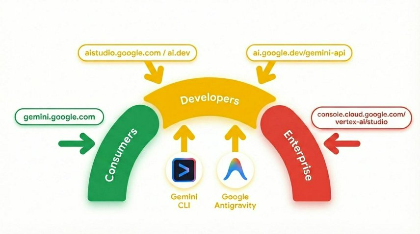

## Obtaining Credits to Use Google Cloud

To claim your credits, visit this [link](https://trygcp.dev/claim/trustable-ai-codelab#vf=8sw) and log in with a Gmail email address ([gmail.com](http://gmail.com) domain).  Then, accept the credits into your Google Cloud Platform (GCP) billing account, and they will be applied to your account.

# Step 3 \- Why Trustable AI Matters

Many AI systems can produce fluent and convincing responses, but fluent is not the same as trustworthy. In real-world systems, users often need timely, grounded responses that are constrained by safety rules and shaped by domain expertise.

This becomes especially important when a system operates on fast-moving data. A response that arrives too late may be useless. A response that sounds confident but ignores important context may be misleading. A response with no connection to human expertise may be difficult to trust, even if it sounds polished.

In the racing car scenario used in this codelab, the issue is not whether AI can say something interesting. The issue is whether the system can provide advice that is useful, safe, timely, and appropriate to the situation.

Let’s look at a small telemetry sample and compare two possible outputs:

```
Racing Car Telemetry Data
{
   "speedMph": 118,
   "throttle": 91,
   "frontGrip": "nominal",
   "rearGrip": "low",
   "trackPosition": "Turn 1 Entry"
}

```

### Naive AI response

	“Stay aggressive on the throttle and carry your speed into Turn 1”

### Trust-aware response

	“Rear grip is low at Turn 1 entry. Reduce your throttle slightly and prioritize a stable corner entry”

Notice the difference?  

What would happen if we only rely on the naive AI response?

The first response sounds confident, but it ignores risk. The second response is more useful because it reflects context and constraint.

Rather than treating the LLM as the entire system, you need to treat it as one part of a broader architecture to increase trustability.  In addition, many applications require advice to be delivered fast enough to be actionable, such as a racecar, medical procedure, aviation, power grid, trading system, maritime navigation, etc.

Now, let’s understand how to create such an architecture.

# Step 4 \- Understanding High-Velocity AI and Modular Trusted Architecture

Some AI systems need very different kinds of behavior. They must react quickly to changing conditions and also support slower, more thoughtful reasoning.

A modular architecture separates these responsibilities into distinct paths. One path can be reflexive, handling immediate, time-sensitive interpretation of incoming signals. Another path can focus on strategy, supporting higher-level reasoning and more context-aware decision-making.  Other paths target other types of functionality.

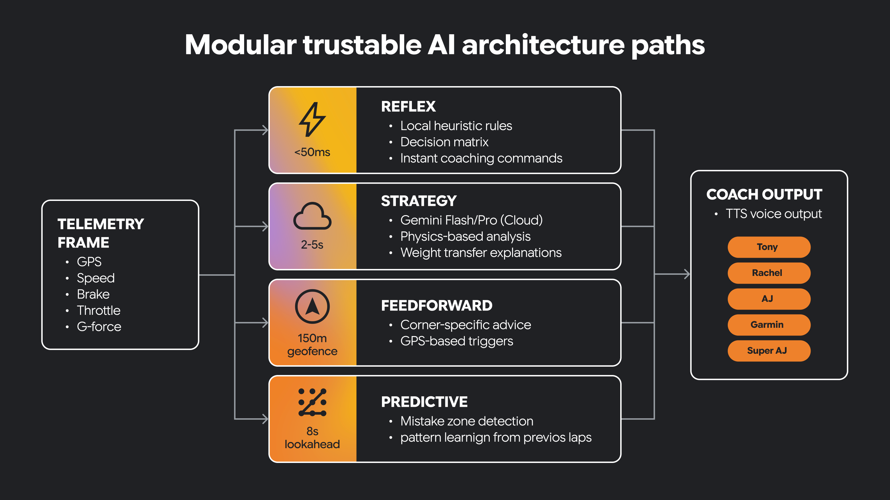

Some decisions must happen in real-time.  Some decisions benefit from longer thinking.

Trustable AI often needs both.

This architectural separation helps the system remain responsive while still supporting richer AI-driven guidance. It also creates a clear place to introduce human-guided constraints and domain knowledge.

In this small program, we have a reflex path and a strategy path implemented as Python functions.

```python
telemetry = {				# The data
	"speed": 147,
	"grip": 0.68,
	"corner_type": "sharp",
	"lap_trend": "entering_corners_too_fast"
}

def reflex_path(event):		# Fast, immediate decision
  if event["grip"] < 0.70:
	return "REFLEX: Reduce throttle now"
return "REFLEX: No urgent issue"

def strategy_path(event):		# Slower, broader interpretation
  if event["lap_trend"] == "entering_corners_too_fast":
	return "STRATEGY: Brake earlier and prioritize corner exit"
return "STRATEGY: Driving pattern looks stable"

print(reflex_path(telemetry))	# Same telemetry data 
print(strategy_path(telemetry))	# Same telemetry data
```

The two functions behave differently given the same telemetry data.  The reflex function is an immediate warning.  The strategy function gives us coaching advice based on rules.

Why do you think it is useful to keep this logic separated? 

Now, let’s build a fun, multi-part application and see how this architecture turns fast reactions and deeper reasoning into a trustable AI system you can actually experience.

# Step 5 \- Build a Telemetry Streaming Server

Now that you understand the architectural goal, it is time to build the data pipeline that drives the application.

In this section, you will create a simple telemetry stream for a virtual race car. The data will come from a CSV source containing GPS or track-position data, and your application will convert it into a live stream that the UI and the AI layer can consume.

## In this section, you will:

* Create a new project in Google Cloud for our streaming server and application  
* Create a small server to emit telemetry data  
* Stream those events to a browser UI or console

## 1\. Open Cloud Shell

1. Go to [Google Cloud Console](https://console.cloud.google.com).  
2. Create a new project for this codelab.  Click on the project dropdown menu at the top.

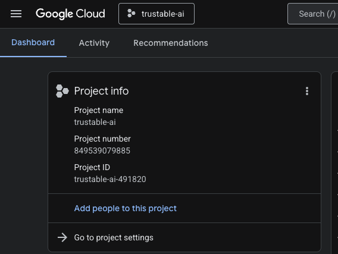

When creating a project, it’s a good opportunity to link the billing account:  
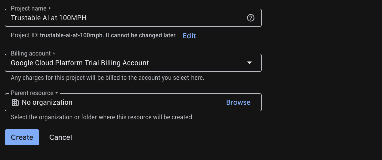

Optionally, if you’ve already created a project, you can open the left panel, click on `Billing`, and check whether the billing account is linked to this `GCP` account.

3. Obtaining a Gemini API key

   Once you have enabled your Google Cloud credits, you need a Gemini API key to access Gemini in Google Cloud.

   

   To create a Gemini API Key, we need to use [Google Vertex AI Studio](https://console.cloud.google.com/vertex-ai/studio) to generate keys.

   

   Within Vertex AI Studio, click on “Get API key” in the bottom left corner above “Documentation”. Create an API key for Gemini (it looks like a long string of seemingly random characters).  Save this key in a secure location.  We will use this API key in Step 6 “Build the Racing Car Simulator” to authenticate our access to Gemini in Google Cloud.


```md
> aside positive 
Keep your API keys out of your source code and never commit them to Git repositories. It is recommended to store them either in environment variables or a secure secrets manager.  Treat API keys like passwords: do not share them in chats, email, screenshots, or logs.  Rotate them regularly. For production systems, you should add monitoring and usage alerts to quickly detect any misuse and immediately revoke compromised keys.
```

4. Click the **Cloud Shell** icon in the top bar (terminal icon) to open a browser-based terminal.  
     
     
5. Wait for the terminal session to start.

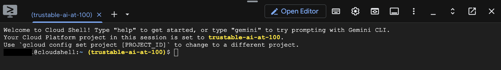  

  

---

## 2\. Get the code

Clone the master repo.

```shell
git clone https://github.com/ocupop/trustable-ai-codelab.git
cd trustable-ai-codelab
```

Notice that there are two folders in this repo: “koru-application” (web application) and “streaming-telemetry-server” (simulated real-time race car telemetry).  This step describes the “streaming-telemetry-server”.  We will use “koru-application” in the next step.

---

## 3\. Enable required APIs

Run *once* per project:

```shell
# Set Project ID
gcloud config set project YOUR_PROJECT_ID
# Enable APIs
gcloud services enable \
  run.googleapis.com \
  cloudbuild.googleapis.com \
  artifactregistry.googleapis.com
```

Replace `YOUR_PROJECT_ID` with your actual project ID (or skip the first line if the project is already set).

You can find YOUR\_PROJECT\_ID in the list of Projects

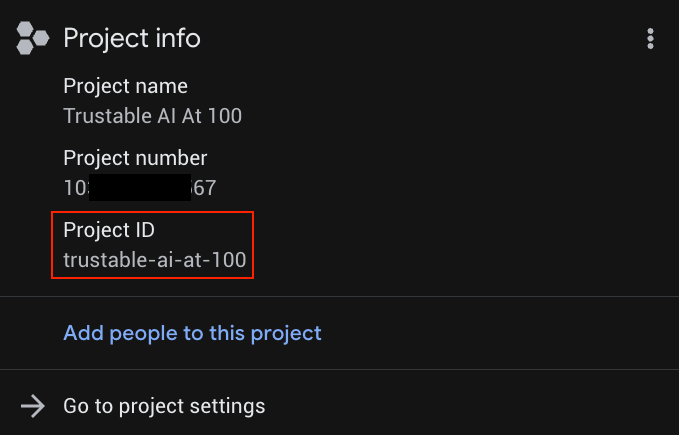  

---

## 4\. Deploy the backend to Cloud Run

From the repo root (ie, make sure you are in the `trustable-ai-codelab` folder):

```shell
gcloud run deploy streaming-telemetry-server \
  --source streaming-telemetry-server \
  --platform managed \
  --region us-central1 \
  --allow-unauthenticated

## Note you may have to press 'Y' when prompted
```

- The first run may prompt you to enable APIs or create an Artifact Registry repo; accept as needed.  
- If you use a different region than `us-central1`, specify that region using `--region`  
- When the deploy finishes, gcloud prints the **service-URL**.  We just need to append “events” to this URL to use it as the full endpoint for the telemetry server.

---

## 5\. Use the stream URL

The telemetry server is now emitting simulated telemetry data using Server-Sent-Events (SSE) at an endpoint of the form :

```
service-URL/events		// service-URL - the last line displayed by "deploy"
```

```md
> aside positive
The format of the streaming endpoint is of the form: `https://streaming-telemetry-server-${PROJECT_NUMBER}.${REGION}.run.app/events` Where `$PROJECT_NUMBER` and `$REGION` are set to their values for your specific server.
```

**Test in a browser:** Visit this stream endpoint URL using Chrome.  You should see incoming streamed data in the browser, simulating data emitted by sensors on a racing car.

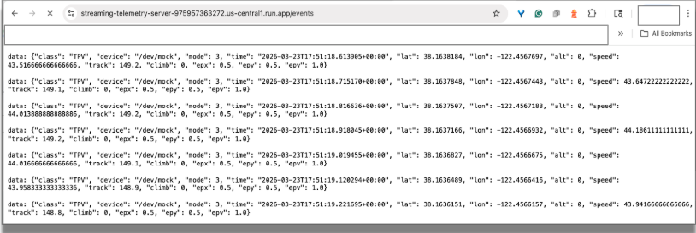

You can close the browser tab to terminate the connection.

**Test with curl:**  

Now let’s test from the shell command line.

```shell
curl -N service-URL/events		# Replace service-URL with actual deployment endpoint
```

You should see incoming streamed data in the cloud shell window. 

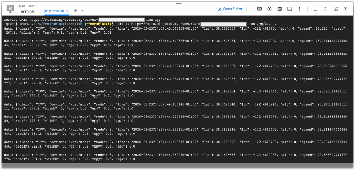

We will use this telemetry data to simulate the data emitted by sensors in a racing car.  The rest of the codelab will use this data.  You can terminate the curl program by entering CTRL-C in the terminal window.

## What You Should Notice

As you complete this section, pay attention to the nature of the incoming data. Raw telemetry is often high-volume, time-sensitive, and not immediately suitable for AI reasoning.  Once we build the front-end application, we will need to filter the raw data into an efficient format that an LLM can process quickly.  

But first, let’s build the web front-end to visualize the data.

# Step 6 \- Build the Racing Car Simulator

## In this section, you will:

* Build a racing car simulation   
* Connect the telemetry server to the racing car web application  
* View simulated races

At this point, we have a working simulation of the telemetry from a racing car running in the cloud.  Now let’s build the application that runs on your local machine, connects to Google Cloud, and visualizes that data.

On your local laptop or desktop computer, let’s clone the front-end application from GitHub:

```shell
git clone https://github.com/ocupop/trustable-ai-codelab.git
cd trustable-ai-codelab
```

Once the repo has been cloned on your laptop or desktop, let’s run the application.

```shell
cd koru-application		# racing car simulation app
npm install
npm run dev
```

```md
> aside positive
“koru” is a symbol from the [Māori culture](https://en.wikipedia.org/wiki/Koru) in New Zealand.  It represents a new beginning. 
```
!VITE[](img/vite.png)

In Chrome, open the port on your local machine ([http://localhost:5173](http://localhost:5173) as in the example above). You'll see the landing page for the “AI Motorsport Coaching” application. 

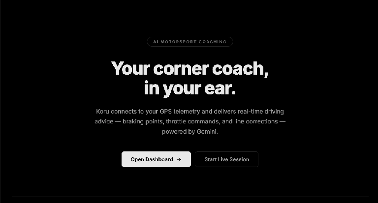

Click on the “Open Dashboard \-\>” button.  This will start the UI for the application.

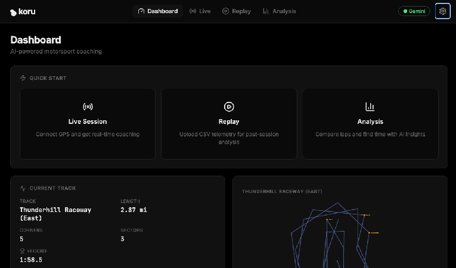

At this point, you have a telemetry server generating simulated race-car telemetry in Google Cloud, and a local web application that can visualize that data and connect to an LLM.  Let’s connect them, and also connect to Gemini LLM services.

In the upper-right corner of the application, click the gear icon (settings).

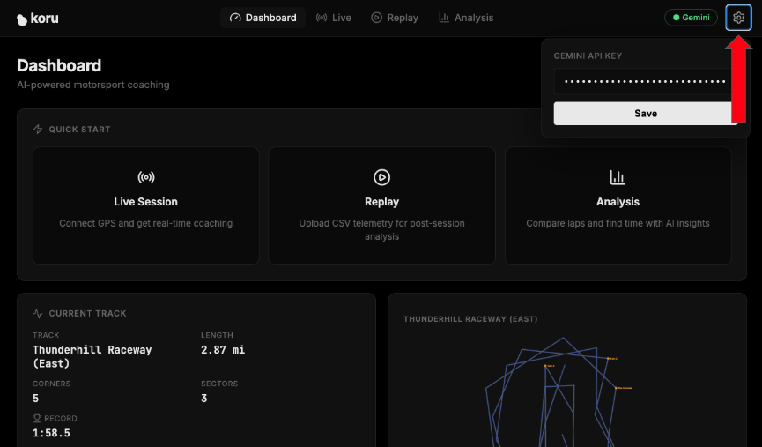

Enter your Gemini API key from Step 2\.  This gives you access to Gemini services in Google Cloud.

Click on “Save” so the application remembers your API key.

Now, let’s connect the application to the telemetry server.   In the application dashboard, click on “Live Session”.

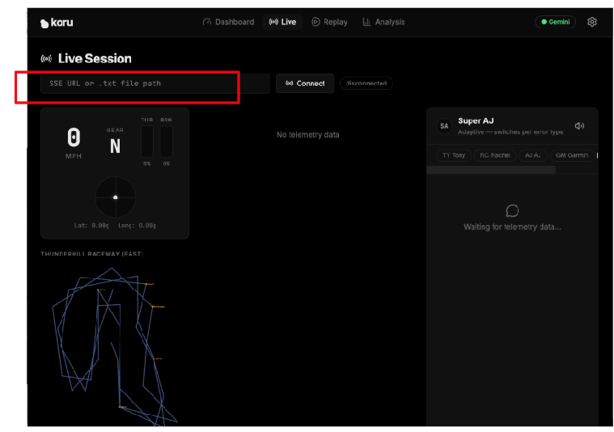

Enter the specific URL of your cloud-based telemetry server (Step 5\) in the text field that says “`SSE URL or .txt file path`”.  Our SSE URL was of the form:

```
https://streaming-telemetry-server-${PROJECT_NUMBER}.${REGION}.run.app/events
```

Once you have entered the telemetry server endpoint URL, click on “Connect” (on the right of the text field). Don’t forget the “events” at the end of the URL.

You should now see the application visualizing the simulated data\!  

If your speaker volume is turned up, you can hear the car racing advice from different types of coaches.  Each coach has a different personality.  Try selecting different coaches to see their varied racing advice and different vocal styles.  If you need to, you can disable the audio by clicking on the speaker icon.

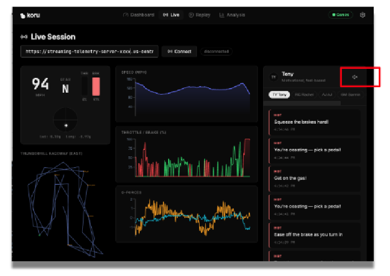

Now that we have a working application, let’s explore how we prepared the data for efficient processing by the LLM and how we can add additional features to enhance the trustability of the overall system.

# Step 7 \- Prepare Telemetry for AI Reasoning

Raw telemetry is useful for simulation, but it is usually too detailed and too frequent to be sent directly to an LLM. If you send all the telemetry data unchanged, you may increase latency, introduce noise, and reduce the quality of the resulting guidance.

In this section, you will reshape the telemetry into a more useful form.

In this section, you will:

* Inspect the raw telemetry JSON  
* Identify which fields are most relevant for reasoning  
* Filter or summarize the data  
* Reduce unnecessary detail  
* Prepare an AI-friendly representation of the driving state

This is an important step in building trustable AI. The quality of the response depends not only on the model, but also on the structure and relevance of the data it receives.

Let’s now explore the specific data for racing cars.  We can experiment by changing specific values in the application, reloading it, and observing the result.

`../src/services/telemetryStreamService.ts   near line 180`
```ts

// Clamp G-forces
gLat = Math.max(-3, Math.min(3, gLat));		// sideways G-force
gLong = Math.max(-3, Math.min(3, gLong));	// front/back G-force
```

G-forces in a car measure acceleration or deceleration.  In a racing car, understanding G-forces helps with the car’s handling and overall performance.  If our application doesn’t have this information, it is difficult to provide advice to the driver.  Comment out those two lines, set both `gLat` and `gLong` values to 0.0, and rerun the application.  

Notice that no advice is given when the car approaches a corner.  This isn’t very helpful for a race driver\!

Then undo your change and rerun the application.  Notice the helpful audio advice when the car reaches a corner?  G-force data points are critical for advice to the driver.

Now, let’s artificially restrict the car’s speed to a leisurely pace of 30 mph.  We won’t win any races at that speed, but it will certainly demonstrate the type of coaching that we receive.

In that same file ([telemetryStreamService.ts](http://telemetryStreamService.ts)) near line 158, you’ll find the function processPoint().  In that function, let’s constrain the speed.

Change:

```ts
private processPoint(point: GpsSSEPoint) {
...
 const speedKmh = point.speed > 200 ? point.speed : point.speed * 3.6;
...
```

To:

```ts
private processPoint(point: GpsSSEPoint) {
...
 let speedKmh = point.speed > 200 ? point.speed : point.speed * 3.6;
 speedKmh = Math.min(speedKmh, 48);   // 48 kmh is approx 30 mph
...

```

Rerun the application.  What type of coaching advice do we now get?  Not much is needed if we are leisurely driving\!

Now revert those changes and rerun the application.

Clearly, the car's speed is a valuable data point.  It is very important to understand what specific data is critical for providing valuable advice.  It is equally important to evaluate what data is not relevant.

You should also begin thinking about safety and trust here. Even well-prepared input does not guarantee a reliable answer. We still need to introduce human-guided rules and explicit constraints.

Data preparation is not just a preprocessing step. It is a critical part of the trust strategy. Cleaner inputs often lead to more focused, more reliable outputs.

# Step 8 \- Add Guardrails and Encoded Human Expertise

A trustable AI system should not rely on model output alone. In many cases, the most reliable systems combine large language model reasoning with explicit rules, domain knowledge, and human-guided constraints.

In this section, you will add that layer.

You can think of this layer as encoded coaching knowledge. It may include preferred response patterns, validation rules, safety checks, or structured guidance that helps the system stay grounded and useful.

In this section, you will:

* Introduce response rules that shape model behavior  
* Apply safety checks to reduce misleading advice  
* Incorporate encoded human expertise into the pipeline  
* Compare responses before and after these additions

Let’s investigate how domain expertise is added to our application.

An LLM is typically not trained in racing or in the physics of race car performance. If our application did include that domain expertise, users could place greater trust in its guidance.  That guidance comes from rules based on human expertise, in other words, a **domain expertise layer.**

`../src/utils/coachingKnowledge.ts   near line 115`
```ts
...
export const RACING_PHYSICS_KNOWLEDGE = `
CORE PRINCIPLES:
1. **The Friction Circle:** A tire has 100% grip. If you use 100% for braking, you have 0% for turning.
  - *Error:* Turning while 100% braking = Understeer (Plowing).
  - *Fix:* "Trail braking" (releasing brake pressure as steering angle increases).

2. **Weight Transfer:**
  - Braking shifts weight forward (Front grip UP, Rear grip DOWN).
  - Accelerating shifts weight backward (Front grip DOWN, Rear grip UP).
  - *Error:* Lifting off throttle mid-corner shifts weight forward abruptly -> Oversteer (Spin risk).

3. **The racing line:**
...

```

These racing car principles are a key ingredient in providing trustable output.  What would happen if we didn’t have this expertise?   Let’s find out.

Let’s remove  *RACING\_PHYSICS\_KNOWLEDGE* and explore our racing advice.

```ts
export const RACING_PHYSICS_KNOWLEDGE = ``;
```

Rerun the application.  What type of coaching advice do we now get?  

Notice the generic advice.  

We no longer get detailed information about friction, weight transfer, exit speed, etc.  Our trustability is lower without this information.  Restore that racing expertise and rerun the application.

This step is a critical aspect of a trustable AI system. Trust is not magically created by a stronger prompt. Trust emerges from system design and critical thinking.

The LLM is part of the solution, but it is not the whole solution. Trust improves when AI output is guided by explicit human knowledge.

# Step 9 \- Design the Coaching Personas and User Experience

Once your reasoning pipeline is in place, the next question is how the system should communicate with the user.

In this section, you will shape the coaching experience by defining how the strategy layer communicates with the driver. You will refine the system prompt for one of the coaching personas and consider how its guidance should be delivered to be clear, timely, and, most importantly, actionable.

In this section, you will:

* Create or refine a system prompt for a coaching persona  
* Experiment with different coaching styles  
* Observe how prompt changes affect the responses  
* Define UI requirements for trustable feedback  
* Understand the text-to-speech (TTS) support for urgent and non-urgent messages


Our application includes several coaching personas.  Each one provides different types of coaching advice.

| PERSONA | CHARACTERISTICS |
| :---- | :---- |
| Tony | Motivational, feel-based |
| Rachel | Technical, physics-focused |
| AJ | Direct, blunt commands |
| Garmin | Data-focused, delta optimization |
| Super AJ | Adaptive, switches per error type |

These personas are defined in the file `../src/utils/coachingKnowledge.ts`.


In this file, you will notice an object map (`COACHES`)  that associates string keys with `CoachPersonas`.  A `CoachPersona` contains attributes of each type of coach.  One important attribute is `systemPrompt`.  Each persona has its own `systemPrompt` that guides the LLM in how to respond.

Let’s alter one of those `system prompts` and see how the LLM responds.

Near line 31, you will see the `systemPrompt` for “AJ”, who is very direct and blunt with his advice.  Let’s change that `systemPrompt` so AJ is excessively polite.

```ts
systemPrompt: `You are AJ, a race engineer that is excessively polite. 
	Use telemtry terminology.  Be actionable
	Examples: 	"Lat G settling. please throttle", 
				"Brake when its convenient."
	Keep responses under 12 words. Never explain — just command.`
```

Rerun the application, select AJ as the coach, and see what type of responses are generated.

Now restore the original `systemPrompt` and rerun the application.  Notice that the system prompt is critical in guiding the LLM to provide a response that fits the persona.

Trust is not only about correctness. It is also about delivery. Advice that is technically accurate can still be ineffective if it is unclear, poorly timed, or distracting.

A trustable system must communicate well. The user experience is part of the trust architecture.

```md
> aside positive 
In a production environment, you would typically assign distinct voices to each coach, rather than a single voice that changes its pitch and inflection.  However, using text-to-speech services requires a significant increase in the amount of tokens that flow over the network. If you use a production cloud account, you will be able to hear different types of coaches' voices.
```


# Step 10 \- Review the End-to-End Architecture

At this point, you have built the major pieces of the system. Now it is time to step back and review how they work together.

Your application now includes these components:

* Telemetry stream  
* Visualization layer  
* AI-ready data transformation stage  
* Strategy components powered by a reasoning LLM  
* Guardrails and encoded human guidance  
* User-facing coaching experience

A useful and simple way to understand the overall flow of these components is to add logging to our application.

We’ll add logging to view the telemetry data as it flows through the paths.

First, let’s just view the telemetry data.  In `telemetryStreamService.ts`, around line 212 (before `this.emit(frame)`, add a line that displays speed, lateral G-force (sideways acceleration), and how hard the driver is pressing the brake pedal.

```ts
console.log('FRAME', { 
    speed: frame.speed.toFixed(1), 
    gLat: frame.gLat.toFixed(2),
    brake: frame.brake.toFixed(0) }
);
```

Reload the application.  Before we run the application, let’s open the console in Chrome’s DevTools to view this debugging information.

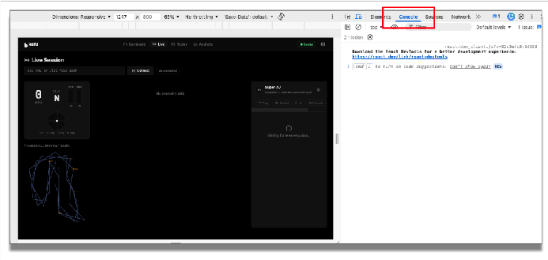

In the application, enter the telemetry endpoint and click “Connect”.   You can now see the incoming telemetry data.

Now, let’s add logging for the reflex path and the strategy path.  

In `../src/services/coachingService.ts` around line 71 before `this.emit()`, add a logging line for the **reflex** path:

```ts
console.log('FRAME:reflex', { 
     speed: frame.speed.toFixed(1), 
     gLat: frame.gLat.toFixed(2), 
     brake: frame.brake.toFixed(0) }
);

```

And in the same file, around line 138, before `this.emit()`, add a similar logging line for the **strategy** path (let’s add the coaching response `text` returned by the Gemini API):

```ts
console.log('FRAME:strategy', { 
   speed: frame.speed.toFixed(1), 
   gLat: frame.gLat.toFixed(2), 
   brake: frame.brake.toFixed(0), 
   text }
);

```

Rerun the application. You’ll notice in the console how the telemetry data flows from the source through these paths.  The incoming stream is filtered, sent to the LLM, verified with trusted human expertise, and presented to the user using an appropriate user interface.

Notice we have connected the various technical components to provide the larger goal of trustable AI. The value of the architecture is not in any one component on its own. The value comes from how the parts reinforce each other.

Trustable AI is an architectural outcome, not a single feature.

## Tear down (removing the service)

It is important to remember to remove the service when you no longer need it.  Once you are done testing the telemetry server along with the application, you should delete the Cloud Run service and stop billing for it:

```shell
gcloud run services delete streaming-telemetry-server \
  --region us-central1 \
  --platform managed
```

Remember to replace `us-central1` with the region you used when deploying, if necessary. Confirm when prompted.

```md
> aside positive 
Optional:  Your container images, packages, and related artifacts are stored in the Artifact Registry.  To avoid storage charges for older, unused data, you should remove them to avoid unnecessary charges.  To remove data from the Artifact Registry, use the Cloud Console: Artifact Registry, then select the repository created by the deploy, and then delete the image or the repository.
```

# 


# Step 11 \- Challenges

Now that the core application is working and you understand the various components, try extending the design.

Suggested challenges

* Move more of the coaching logic to the edge  
* Modify the simulation to support rain or reduced traction  
* Explore how model tuning or [fine-tuning](https://codelabs.developers.google.com/llm-finetuning-supervised) could improve performance  
* Adapt the architecture for another domain, such as medicine, manufacturing, or logistics

These challenges encourage you to think beyond the racing example and recognize the broader design pattern of trustability behind this codelab.


# Step 12 \- Wrap Up and Next Steps

In this codelab, you built more than a racing demo. You built a concrete example of how trustable AI systems can be designed.

You started with raw telemetry, transformed it into a useful format for an LLM, applied AI reasoning, and strengthened the output with encoded human guidance and response constraints. Along the way, you saw that trust comes from architecture, not from model output alone.

A trustable AI system often combines:

* Structured real-time data  
* Model-based reasoning  
* Encoded domain expertise  
* Explicit guardrails  
* Thoughtful user experience design

The racing scenario helped make these ideas tangible, but the same approach can be used anywhere that AI recommendations must be timely, actionable, and dependable.


