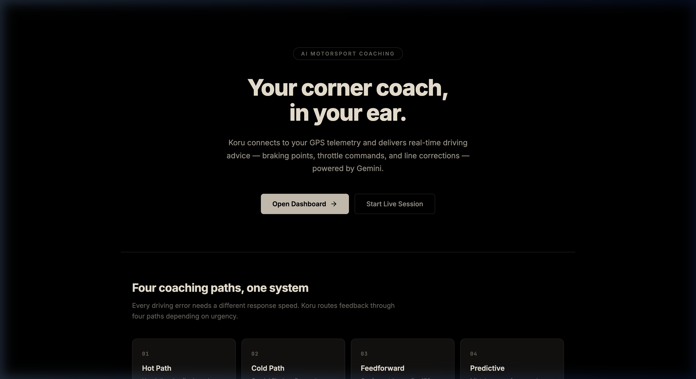

# koru

Real-time AI driving coach for track days. Connect your GPS telemetry, pick a coach persona, and get braking points, throttle calls, and line corrections spoken into your ear — powered by Gemini.



## What it does

You're mid-session at Thunderhill. You brake too early into Turn 5, coast through the apex, and get on throttle late. Koru catches all three mistakes and tells you what to fix — in real time.

It routes coaching through four paths depending on how urgent the feedback is:

- **Hot Path** — Heuristic rules fire in under 50ms. No cloud round-trip. "Trail brake!" "Commit!"
- **Cold Path** — Gemini Flash/Pro analyzes multi-frame telemetry. Physics-based explanations with weight transfer context.
- **Feedforward** — Geofence triggers 150m before each corner. You hear the advice *before* you need it.
- **Predictive** — Tracks your mistake zones from previous laps. 8-second lookahead alerts before you repeat errors.

## Coaches

Five AI personas, each with a different communication style. Switch mid-session.

| Coach | Style | Example |
|-------|-------|---------|
| **Tony** | Motivational | "Commit! Trust the grip!" |
| **Rachel** | Technical | "Trail off brake before turn-in. Balance the platform." |
| **AJ** | Direct | "Brake 5m later." |
| **Garmin** | Data | "Entry speed: -8 mph vs ideal. +0.3s potential." |
| **Super AJ** | Adaptive | Switches style per error type — safety, technique, or confidence. |

## Quick start

```bash
git clone https://github.com/user/koru.git
cd koru
npm install
npm run dev
```

Open `http://localhost:5173`. You'll see the landing page. Click **Open Dashboard** to get into the app.

### Gemini API key

Click the gear icon in the navbar and paste your [Gemini API key](https://aistudio.google.com/apikey). This enables:

- Cold path cloud analysis (Gemini Flash / Pro)
- Post-session AI lap comparison
- Google Cloud TTS voice output

The hot path works without an API key — it uses local heuristic rules.

### Live session

1. Start your GPS telemetry source (OBD dongle, RaceChrono SSE, or similar)
2. Go to **Live** → paste the SSE endpoint URL → click **Connect**
3. Pick a coach persona and drive

### Replay

1. Go to **Replay** → upload a CSV from your datalogger
2. Scrub through the session with synchronized speed/throttle/brake/G-force charts
3. Click **AI Analyze** to get Gemini's take on a specific section

### Lap comparison

1. Go to **Analysis** → upload two CSVs (Lap A and Lap B)
2. Click **Compare Laps** for a sector-by-sector AI breakdown

## Tech stack

- React + TypeScript + Vite
- Recharts for telemetry visualization
- Gemini Flash / Pro for cloud coaching analysis
- Web Speech API + Google Cloud TTS for voice output
- Canvas API for track map rendering
- SSE (Server-Sent Events) for live GPS telemetry

## Current track

Thunderhill Raceway East (Willows, CA) — 2.86 mi, 15 turns. Track data lives in `src/data/trackData.ts`. Adding new tracks means defining corner coordinates, sectors, and a reference line.

## Project structure

```
src/
  components/    # GaugeCluster, TrackMap, TelemetryCharts, CoachPanel, etc.
  data/          # Track definitions (Thunderhill East)
  hooks/         # useGPS, useGeminiCloud, useTTS, usePredictiveCoaching
  pages/         # Landing, Dashboard, LiveSession, Replay, Analysis
  services/      # CoachingService (hot/cold path orchestration)
  utils/         # Telemetry parser, coaching knowledge, decision matrix
  types.ts       # TelemetryFrame, GPSData, CoachPersona, etc.
```

## License

MIT
